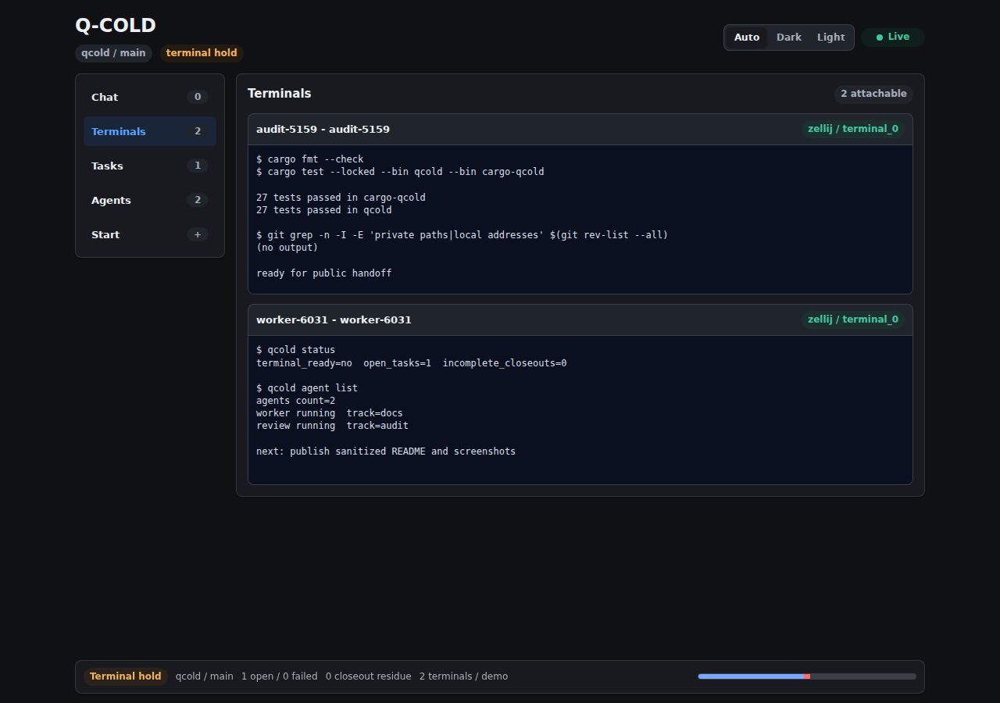

# Q-COLD

Q-COLD is an extracted orchestration facade for agent-driven task-flow work.
The name expands to QQRM Collaboration, Orchestration, Lifecycle, and Delivery.



Q-COLD owns the operator-facing command surface and keeps repository-specific
proof, validation, and closeout semantics behind explicit adapter traits. The
first adapter is a generic xtask process adapter, so Q-COLD can build without
a Cargo path dependency on any target repository. Q-COLD also ships its own
repository-local `xtask` adapter so Q-COLD development can dogfood the same
`qcold task ...`, `qcold verify ...`, and `qcold ci ...` surfaces. Install the
standalone operator binary plus Cargo subcommand compatibility locally with:

```bash
cargo install --path . --locked
```

Then register repository connections in Q-COLD state and run adapter-backed
commands through the active repository:

```bash
qcold repo add target-repo /path/to/target-repo \
  --xtask-manifest /path/to/target-repo/xtask/Cargo.toml \
  --set-active
qcold repo list
qcold status
qcold task-record create --description "Add task CRUD and automatic capture"
qcold task-record list
qcold agent list
qcold agent start --track audit -- codex exec "inspect repo"
qcold agent start --terminal --attach --track c2 -- c2 "work on the active task"
qcold telegram poll
qcold telegram serve --listen 127.0.0.1:8787 --daemon
qcold bundle
qcold task inspect runtime-audit
qcold task open my-task
```

`cargo qcold <command>` remains supported for Cargo subcommand compatibility,
but `qcold <command>` is the primary operator interface.
Use `qcold --version` or `cargo qcold --version` to check the installed
operator binary. The reported version includes the Cargo package version, a
monotonic Git commit-count build number, and the Git commit hash embedded when
that binary was built. A dirty local rebuild reports the next build number so
changed-but-uncommitted operator binaries are distinguishable from the last
clean commit build.

## Task records

Q-COLD stores lightweight task records in its local SQLite database. Use
`qcold task-record create`, `list`, `show`, `update`, `close`, and `delete` for
direct CRUD. When a record has a repository root, `create` assigns a stable
repo-scoped `sequence` number and returns the existing number on later
idempotent creates for the same task id. Descriptions are normalized before
storage so operator phrasing is kept as a concise task description instead of
a raw chat transcript.

Adapter-backed `qcold task open <slug>` automatically creates or updates a
Q-COLD task record with source `task-flow`. When that record has a repo-scoped
`sequence`, Q-COLD passes it to the repository adapter as
`QCOLD_TASK_SEQUENCE` so managed task anchors can use an operator-sortable
monotonic number instead of a random-looking suffix. Q-COLD-managed agent starts also
create an ad-hoc task record when the wrapped `c1`, `cc1`, `c2`, `cc2`, or `codex` command
contains an explicit prompt argument. Interactive prompts typed later inside an
already-open terminal are imported from Codex session JSONL telemetry under
`~/.codex-accounts/<slot>/sessions` when task records, agent lists, or the web
dashboard are refreshed. Local `cc1` and `c1` wrappers are treated as Codex
account `1`; local `cc2` and `c2` wrappers are treated as Codex account `2`.
The importer reads Codex `session_meta`, matches sessions to the
Q-COLD agent start time and active repository cwd, and does not assign a
claimed `session_path` to another agent. It stores the polished first
meaningful user prompt plus the latest Codex token counters in task metadata.
For adapter-backed task-flow records, Q-COLD also refreshes compact Codex token
telemetry from matching session JSONL files while task records or the dashboard
are loaded. It matches the managed worktree or task slug and task time window,
sums Codex `last_token_usage` samples into per-task `token_usage` metadata, and
stores bounded `token_efficiency` metadata for session counts plus the largest
tool outputs by reported `Original token count`. Q-COLD keeps only metadata,
not raw tool output, and limits task-flow session import to the recent Codex
telemetry window. The default retention window is 48 hours; set
`QCOLD_CODEX_TELEMETRY_RETENTION_HOURS` to another positive hour count for one
process. The metadata is refreshed before terminal `task closeout` updates the
record status. `qcold status` also triggers the refresh and prints compact
`task-record-tokens` and `task-record-efficiency` aggregates when task records
contain imported telemetry. `qcold task-record show <task-id>` prints
`token-usage` and `token-efficiency` lines for the selected record when that
per-task telemetry is available.

## Web interface

The Telegram Mini App server exposes the local operator dashboard. It includes
the meta-agent chat, task-flow status, managed agents, attachable terminal
panes, and a command composer for starting tracked agents.

`qcold repo add` stores repository connections in the local Q-COLD
SQLite database. Adapter-backed commands such as `status`, `task`, `verify`,
`ci`, `build`, `install`, `compat`, and `ffi` use the active repository instead
of the daemon process cwd. Worktree-sensitive commands such as `task closeout`,
`task enter`, `task finalize`, `task iteration-notify`, and validation commands
run from a managed task worktree use that worktree even when a primary checkout
is the active repository. If no repository is registered, Q-COLD falls back to
the current checkout for development compatibility. `QCOLD_REPO_ROOT` and
`QCOLD_ACTIVE_REPO` can override the resolved connection for one process.

Telegram polling is configured with `TELEGRAM_BOT_TOKEN` plus
`QCOLD_TELEGRAM_OPERATOR_CHAT_ID` or `TELEGRAM_CHAT_ID`. Command-capable
polling fails closed unless `QCOLD_TELEGRAM_ALLOWED_USER_IDS` or
`QCOLD_TELEGRAM_ALLOWED_USERNAMES` is set. Prefer
`QCOLD_TELEGRAM_ALLOWED_USER_IDS` with comma-separated numeric Telegram user
ids; usernames are useful only as a bootstrap fallback because they can change.
Use `/whoami` in the operator chat to see the numeric Telegram user id to place
in that allowlist. On poller startup Q-COLD publishes the current Bot API
command list with `setMyCommands` so Telegram clients can show slash-command
hints. Direct private chats are accepted only when the Telegram account is in
the operator allowlist; group and forum commands must come from the configured
chat. `/status` returns a human-readable repository task summary for Telegram,
`/agents` returns the Q-COLD managed-agent registry, and
`/agent_start <track> :: <command>` starts an agent through Q-COLD. `/repos`
shows registered repository connections and the active repository. `/app`
returns a Telegram Mini App launch button when `QCOLD_TELEGRAM_WEBAPP_URL` is
set. The Mini App itself is served by `qcold telegram serve --listen <addr>` and
exposes an Axum-backed operator dashboard with repository context, task-flow
status, managed agents, shared local history, and a meta-agent command
composer. Use `--daemon` for the persistent local control plane:

```bash
qcold telegram serve --listen 127.0.0.1:8787 --daemon
```

Daemon mode forks the current Q-COLD executable, detaches it from agent
lifetimes, writes pid and log files under `QCOLD_STATE_DIR` or
`~/.local/state/qcold`, and replaces any previous Q-COLD Mini App daemon for
the same listen address. The web assets are embedded in the Q-COLD binary, so
rerun the daemon command after `cargo install --path . --locked` or another
Q-COLD rebuild to serve the same binary/assets version that was just installed.
Without `--daemon`, `telegram serve` stays in the foreground for systemd or
other external supervisors.

The dashboard opens to the meta-agent chat and keeps repository/task/agent
overview state in a compact always-visible status strip. Its Queue view accepts
one task prompt at a time, appends it to a visible ordered queue, shows a
dropdown of detected local Codex-like agent commands (`c1`, `cc1`, `c2`,
`cc2`, `codex`, and `codexN`), and starts one fresh Q-COLD terminal agent per
queued prompt through `/agent_start`, with internal agent track and task slug
names generated automatically. Queue rows can be reordered, removed, or copied
before execution. The browser-side queue starts the next prompt only after the
matching task record reaches `closed:success`; any blocked, failed, unknown,
prematurely exited, or unavailable-agent task stops the remaining queue. Its
Tasks view
shows Q-COLD task records for the active repository from SQLite as separate active
and historical sections, including open/closed counts, last-24-hour activity,
aggregate Codex token telemetry, and average closed-task token cost imported
from session JSONL metadata. Raw managed-worktree status remains available for
debugging. It streams state and history updates with server-sent events and
includes an `Auto`/`Dark`/`Light` theme switch stored in browser local storage.
The web chat displays web-origin messages only, while the meta-agent prompt can
still use the broader shared local history as context. The Agents view shows
detected local agent commands and their account/auth/limit probe status before
the running-process sections. Limit probes run through a cached
`/api/agent-limits` request when the Agents view is opened or refreshed. Q-COLD
uses each account's base command such as `c1`, `c2`, or `codexN` with
`exec status`, retries transient failures, and avoids compact `cc*` wrappers so
probing does not create terminal-agent sessions. The same view shows only
currently running Q-COLD tracked agents and separates them from host-discovered
agent programs: native `codex` processes plus the Q-COLD web control daemon.
Exited Q-COLD agent records remain available through the CLI registry surface,
but the dashboard omits them as historical noise. Task-flow helper programs
such as `xtask` are not counted as agents.
The Terminals view exposes attachable terminal panes for agent programs,
captures recent pane output with ANSI color/style attributes, and sends input
from each terminal card through backend-native paste plus a submit key. The
view gives Q-COLD-started terminals short generated Greek philosopher names
such as `Socrates` or `Diogenes` and keeps them unique among running agents.
Existing discoverable terminals fall back to their session and current
command. Click a terminal title in the browser to override its name or set a
short scope label such as `refactoring`; those overrides are stored in Q-COLD
state. The default backend is `tmux`.
Set `QCOLD_TERMINAL_BACKEND=zellij` to start new Q-COLD terminal agents through
`zellij` instead; the GUI discovers both Q-COLD `tmux` and `zellij` sessions.
Plain processes started in a non-multiplexed console are visible as host
processes but are not safely attachable after the fact. Start agents with
`qcold agent start --terminal --attach --track <track> -- <command>...` to see
the same session in the local terminal and in the Q-COLD Terminals view. For a
local `c2` wrapper, use the command shape
`qcold agent start --terminal --attach --track c2 -- c2 "<prompt>"`.
Q-COLD starts Codex-like agent commands (`c1`, `cc1`, `c2`, `cc2`, `codex`,
and `codexN`) from an explicit launch directory instead of inheriting the
daemon cwd. If the launch directory is not already a managed task worktree,
Q-COLD first creates a persistent agent-owned Git worktree under
`../WT/<repo>/agents/<agent-id>/`, initializes Git submodules with
`git -c protocol.file.allow=always submodule update --init --recursive` when
`.gitmodules` is present, and
then starts the agent from that worktree. This keeps Codex resume and
context-compaction fallbacks anchored in the agent's isolated workspace instead
of the primary checkout. The agent-owned worktree is a host-side home base, not
a task devcontainer; the agent should enter a devcontainer only after opening a
specific managed task worktree. Task worktrees opened later by the agent remain
separate and can be closed without deleting the agent workspace. Q-COLD exports
the primary checkout as `QCOLD_REPO_ROOT` and the agent-owned worktree as
`QCOLD_AGENT_WORKTREE` for the launched agent, so active inventory commands
such as `qcold task list` resolve through the task's primary checkout.
Worktree-sensitive commands such as `task closeout` still prefer the current
managed task worktree when the agent has changed into one. In that agent
context, successful task closeout leaves the closed task worktree detached and
untracked instead of removing the directory from under the live agent process;
the closeout output prints `task-return <agent-worktree>` so the agent can
return to its stable workspace before starting another chat or task. Use
`--cwd <path>` to choose the launch context explicitly. Set
`QCOLD_AGENT_MANAGED_WORKTREE=0` only for debugging when this automatic
isolation should be bypassed.
When the wrapped agent exits, the terminal session exits too, so `/q` in an
attached agent returns to the parent terminal without an extra shell prompt.
Terminal backend follow-up work is tracked in
[`docs/terminal-backlog.md`](docs/terminal-backlog.md).
GUI command execution is enabled for the local server by default. If the GUI is
intentionally exposed beyond the local host, set
`QCOLD_WEBAPP_REQUIRE_WRITE_TOKEN=yes` and `QCOLD_WEBAPP_WRITE_TOKEN`; POST
requests must then send it as `X-QCOLD-Write-Token`.

Q-COLD state is stored in one local SQLite database under `QCOLD_STATE_DIR` or
`~/.local/state/qcold/qcold.sqlite3`. The database owns repository registry,
chat history, managed-agent records, Telegram task topics, events, and the
initial schema for runs, claims, budgets, and recipes. Legacy `agents.tsv`,
`telegram_tasks.tsv`, and `task-events/*.log` files are imported on first read
when the corresponding SQLite tables are empty.

Telegram
Mini Apps require a public HTTPS URL; run the local server behind an HTTPS
reverse proxy or tunnel before setting `QCOLD_TELEGRAM_WEBAPP_URL`. Plain
messages in `QCOLD_TELEGRAM_META_CHAT_ID`, or replies in an allowed chat, are
routed to `QCOLD_META_AGENT_COMMAND` when it is set. If it is unset, Q-COLD
uses `c1 exec --ephemeral --cd <repo> -` from the active repository, so the
meta-agent uses the local C1 Codex account while Codex session state is not
persisted between meta-agent runs. The meta-agent prompt includes the latest
shared local history entries plus the current operator message.

In a forum supergroup, `/task <description>` creates a per-task topic when the
bot has permission to manage topics. Q-COLD stores the topic mapping under
`QCOLD_STATE_DIR` or `~/.local/state/qcold`, and later messages in that topic
are recorded as task input.

Adapter-backed commands run from a target repository checkout with
`cargo xtask`, or through `QCOLD_XTASK_MANIFEST` when an explicit xtask
manifest path is needed. In the Q-COLD checkout itself, `.cargo/config.toml`
defines `cargo xtask` as the self-hosted adapter in `xtask/`, so normal
development can start with `QCOLD_REPO_ROOT=$PWD cargo qcold task open <slug>`
from a clean primary checkout, or with plain `cargo qcold task open <slug>` when
the Q-COLD repository is the active registered repo. A sibling checkout layout
is still supported as a local convenience for development:

```text
repos/github/
  qcold/
  target-repo/
```

The production dependency graph does not include `../target-repo/xtask`; adapter
calls cross the process boundary.

`qcold bundle` writes one source ZIP archive for the current repository into
the repository-local `bundles/` directory, which is ignored by git. The command
requires a clean worktree and prints `BUNDLE_PATH=...` for handoff. Bundle
metadata is embedded inside the ZIP at `metadata/bundle-manifest.txt`.

## Development contract

This repository follows the task-flow and delegation discipline captured in
[`AGENTS.md`](AGENTS.md). Q-COLD owns a minimal self-hosted task-flow adapter
for dogfooding: managed worktrees are created under `../WT/qcold/`, success
closeout runs `cargo fmt --check` plus the serial `cargo-qcold` unit suite,
then fast-forwards the primary checkout when possible. Repository-specific
proof semantics for other projects remain behind their adapters.
The planned extraction backlog for moving deterministic task-flow ownership
into Q-COLD is tracked in
[`docs/taskflow-extraction/`](docs/taskflow-extraction/README.md).
